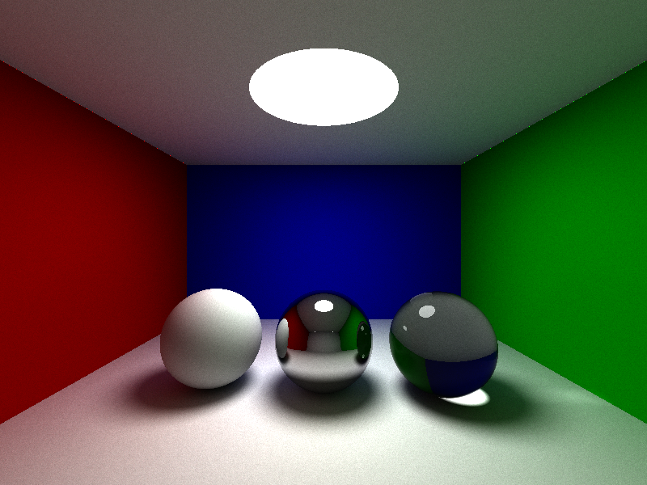
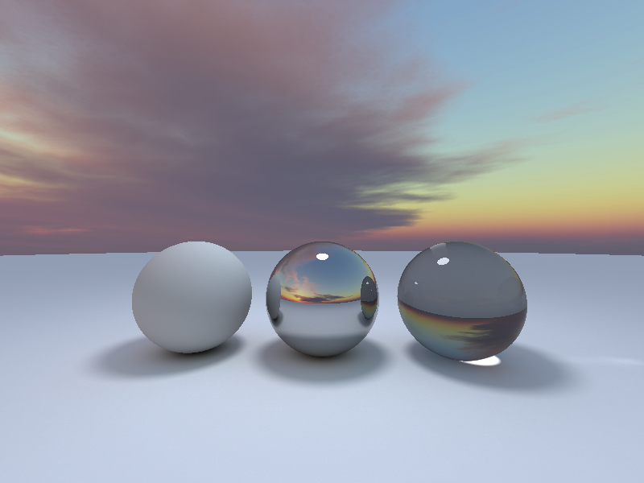

# OpenGL Pathtracer with Compute Shaders

## Features

-   [x] moveable camera
-   [x] depth of field
-   [x] environment sampling
-   [x] imgui integration
-   [ ] object loading
-   [ ] physically based rendering
-   [ ] triangle mesh rendering

## Inspiration

-   [Shadertoy smallpt](https://www.shadertoy.com/view/4sfGDB)
-   https://www.mattkeeter.com/projects/rayray/
