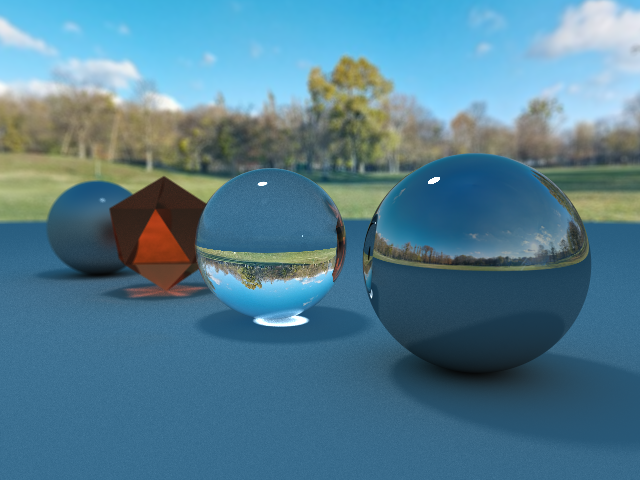

# Pathtracing in a OpenGL Compute Shader



## Features

-   [x] moveable camera
-   [x] depth of field
-   [x] environment sampling
-   [x] imgui integration
-   [x] triangle mesh rendering
-   [ ] object loading
-   [ ] json scene loading
-   [ ] accelaration structures 
-   [ ] physically based rendering

## Build

### Windows

```bash
mkdir build
cmake -G Ninja build/
cmake --build build/
```

## Inspiration & Sources

-   [Shadertoy smallpt](https://www.shadertoy.com/view/4sfGDB)
-   [rayray](https://www.mattkeeter.com/projects/rayray/)
-   [rpt](https://github.com/ekzhang/rpt)
