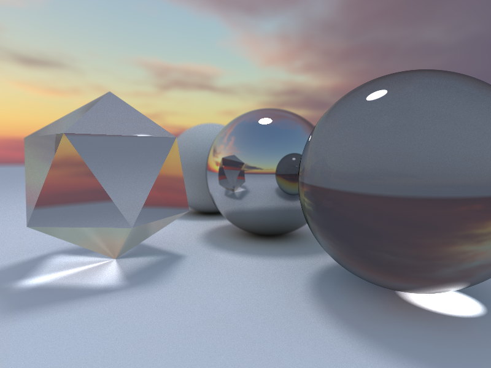

# OpenGL Pathtracer with Compute Shaders



## Features

-   [x] moveable camera
-   [x] depth of field
-   [x] environment sampling
-   [x] imgui integration
-   [x] object loading
-   [x] triangle mesh rendering
-   [ ] accelaration structures 
-   [ ] physically based rendering

## Build

### Windows

```bash
cmake -G Ninja ..
cmake --build . 
```

## Inspiration

-   [Shadertoy smallpt](https://www.shadertoy.com/view/4sfGDB)
-   [rayray](https://www.mattkeeter.com/projects/rayray/)
